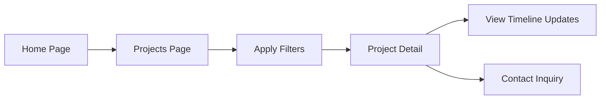
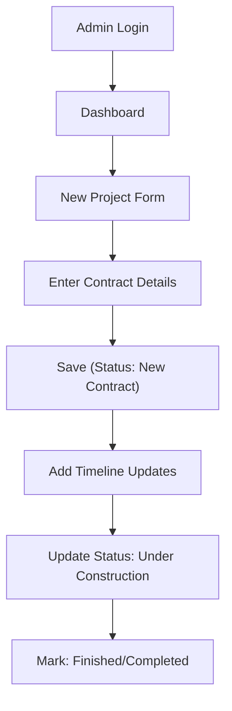

## 1. Product Overview

Lamed Construction is a modern web application for an Ethiopian construction company based in Addis Ababa. The application serves as both a public-facing portfolio website showcasing the company's services, projects, and contact information, and as a powerful admin dashboard for managing project contracts, updates, and company content.

- **Purpose**: Provide a professional online presence for Lamed Construction with full content management capabilities.
- **Target Users**: 
  - Public visitors (potential clients, partners, job seekers)
  - Company administrators (project managers, owners)
- **Market Value**: Digitize and centralize project management while attracting clients through a professional, modern portfolio.

## 2. Core Features

### 2.1 User Roles

| Role | Registration Method | Core Permissions |
|------|---------------------|------------------|
| Public Visitor | None (no registration) | Browse projects, services, about, news; submit contact form |
| Administrator | Pre-configured credentials (admin@lamed.com / admin123) | Full CRUD on projects, updates, news; view/manage contact inquiries; dashboard analytics |

### 2.2 Feature Module

1. **Home Page**: Hero banner with company tagline, featured projects carousel, services overview, stats counter, CTA section
2. **About Page**: Company story, mission/vision, team members, certificates gallery
3. **Services Page**: Detailed service cards with descriptions, icons, and filtering
4. **Projects Page**: Project gallery with filters (status: ongoing/finished, type: residential/commercial/special), detailed project view with timeline updates
5. **News/Blog Page**: Company announcements, project milestones, industry insights
6. **Contact Page**: Contact form, contact info cards, map, social links
7. **Admin Dashboard**: Overview with statistics, quick actions, recent activity
8. **Admin Projects**: Create/edit/delete projects with contract details, status management (contract/ongoing/finished), project updates timeline
9. **Admin News**: Create/edit/delete news/blog posts
10. **Admin Inquiries**: View/manage contact form submissions with status tracking
11. **Admin Login**: Secure authentication gate

### 2.3 Page Details

| Page Name | Module Name | Feature description |
|-----------|-------------|---------------------|
| Home | Hero Section | Full-screen hero with background image, animated tagline "BUILD HONESTLY", CTA buttons |
| Home | Stats Counter | Animated number counters: Projects Completed, Ongoing Projects, Happy Clients, Years Experience |
| Home | Featured Projects | 3 featured project cards with hover effects, link to all projects |
| Home | Services Overview | 5 service icons with quick descriptions |
| Home | CTA Banner | Call-to-action banner prompting contact |
| About | Company Introduction | Two-column layout with text and image |
| About | Mission & Vision | Side-by-side cards with icons |
| About | Certificates | Image gallery with lightbox |
| Services | Service Grid | Filterable service cards with icons, descriptions, hover animations |
| Projects | Project Filters | Status filters (All, Ongoing, Finished) and type filters (Residential, Commercial, Special, Mixed Use) |
| Projects | Project Cards | Image, title, status badge, type, client info, view details button |
| Project Detail | Project Info | Full description, client, contract value, start/end dates, location |
| Project Detail | Timeline Updates | Chronological updates with dates, titles, descriptions, optional images |
| News | Article List | Blog-style cards with date, category, image, excerpt, read more |
| News Detail | Full Article | Rich content, featured image, related articles |
| Contact | Contact Form | Name, Email, Phone, Service Select, Message fields with validation |
| Contact | Contact Cards | Phone numbers, email, location, working hours, emergency contact |
| Admin Login | Login Form | Email + password with validation, error messages, remember me |
| Admin Dashboard | Stats Cards | Total projects, ongoing, finished, pending inquiries, total revenue |
| Admin Dashboard | Recent Projects | Table of 5 most recent projects with status |
| Admin Dashboard | Recent Inquiries | List of 5 latest contact submissions |
| Admin Projects | Project Table | Sortable/filterable table with edit/delete actions |
| Admin Projects | Project Form | Title, description, type, status, client name, contract value, start date, end date, location, image upload, gallery |
| Admin Projects | Status Management | Dropdown: New Contract → Under Construction → Completed/Finished |
| Admin Projects | Update Timeline | Add progress updates with date, title, description, optional photo |
| Admin News | News Table/Form | CRUD for blog posts with categories |
| Admin Inquiries | Inquiry List | Table with read/unread status, reply status, view details modal |

## 3. Core Process

### Main User Flows

**Public User - Browsing Projects**:
Visitor lands on Home → Clicks "Projects" in navigation → Views project gallery → Applies filters (e.g., "Finished") → Clicks a project card → Views project details, contract info, and timeline updates → May navigate to Contact to inquire about similar work.

**Admin - Creating New Project Contract**:
Admin visits /admin → Enters credentials → Lands on Dashboard → Clicks "New Project" → Fills project form (title, client, contract value, dates, type, images) → Saves → Project appears as "New Contract" status → Admin adds timeline updates as project progresses → Marks project "Finished" when complete.

## 4. User Interface Design

### 4.1 Design Style

**Aesthetic Direction**: Modern Industrial Luxury — blending the rugged, trustworthy feel of construction with polished, modern web design.

- **Primary Colors**: 
  - Deep Navy Blue (`#0f172a`) — represents trust, professionalism, stability
  - Burnt Orange/Construction Amber (`#d97706`) — accent color representing energy, construction, attention
- **Secondary Colors**:
  - Steel Gray (`#64748b`) — text, borders
  - Warm Off-White (`#f8fafc`) — backgrounds
  - Success Green (`#059669`) — finished status badges
  - Warning Amber (`#f59e0b`) — ongoing status badges
  - Info Blue (`#2563eb`) — new contract status
- **Button Style**: Rounded corners (8px), solid fills with subtle 2px elevation on hover, smooth transition
- **Typography**:
  - Display/Headings: **Playfair Display** (serif, authoritative, architectural feel) for H1/H2
  - Body/UI: **Inter** (clean, modern, highly readable) — 300/400/500/600/700 weights
  - Font sizes: xs-12, sm-14, base-16, lg-18, xl-20, h3-24, h2-32, h1-48/60
- **Layout Style**: Card-based with generous whitespace, subtle shadows (shadow-md/lg), rounded corners (8-16px), section dividers with topographic/construction pattern accents
- **Icons**: Lucide React icons (outline style, consistent 20px size)
- **Visual Effects**: Grain/noise texture overlay on hero sections, subtle parallax, staggered fade-in animations on scroll, hover lift effects on cards (-4px translate), gradient overlays on project images

### 4.2 Page Design Overview

| Page Name | Module Name | UI Elements |
|-----------|-------------|-------------|
| Home | Hero Section | Full-viewport height, grain texture overlay, gradient overlay from navy to transparent, Playfair Display heading with staggered reveal, "BUILD HONESTLY" in large amber uppercase tracking-widest, dual CTA buttons (Contact + Projects) |
| Home | Stats Section | 4 cards in grid, large amber numbers with count-up animation, subtle icon backgrounds |
| Home | Featured Projects | 3 project cards with image aspect-[4/3], hover zoom on image, status badge in corner, title + client name |
| Home | Services Overview | Icon cards with hover:scale-105, amber icon on hover, 2-column grid on mobile |
| About | Certificates Gallery | 3-column grid, image cards with lightbox on click, zoom icon overlay |
| Projects | Filter Bar | Pill-shaped filter buttons, active state with amber fill, two rows (Status + Type) |
| Projects | Project Grid | Responsive 3-col grid, card aspect-[4/5], image with gradient overlay at bottom, title overlay, status badge pill |
| Project Detail | Timeline | Vertical line with amber dots, date badge left, update card right with optional image thumbnail, alternating if wide screen |
| Contact | Contact Form | Floating label inputs, amber focus rings, card with shadow, success toast on submit |
| Admin Login | Login Card | Centered card with construction-themed illustration placeholder, input fields with icons, submit button with loading state |
| Admin Dashboard | Layout | Sidebar navigation (dark navy) + main content (white), stat cards with colored left borders |
| Admin Dashboard | Tables | Clean rows, striped hover, action buttons (edit icon, delete icon), status pills |
| Admin Forms | Modal/Page Forms | Grouped fields, labels above inputs, required asterisks, amber submit, cancel outline |

### 4.3 Responsiveness

- **Desktop-first design** targeting 1280px+ widescreen displays with 1440px max content width container (mx-auto)
- **Breakpoints**:
  - `lg` (1024px): Sidebar collapses to icons in admin, 3-col grids → 2-col
  - `md` (768px): 2-col → 1-col, tables become horizontally scrollable, navigation collapses to hamburger menu with slide-in drawer
  - `sm` (640px): Reduced paddings, full-width buttons, typography scale down, hero text sizes reduced
- **Touch optimization**: Min 44px touch targets, no hover-only states on mobile, pull-to-refresh on admin tables, swipe support for project image galleries
- **Admin layout**: On mobile, sidebar becomes a bottom tab navigation (Dashboard / Projects / News / Inquiries)

### 4.4 3D Scene Guidance

Not applicable for this project. Static imagery from the existing assets folder will be used for projects and hero backgrounds.
