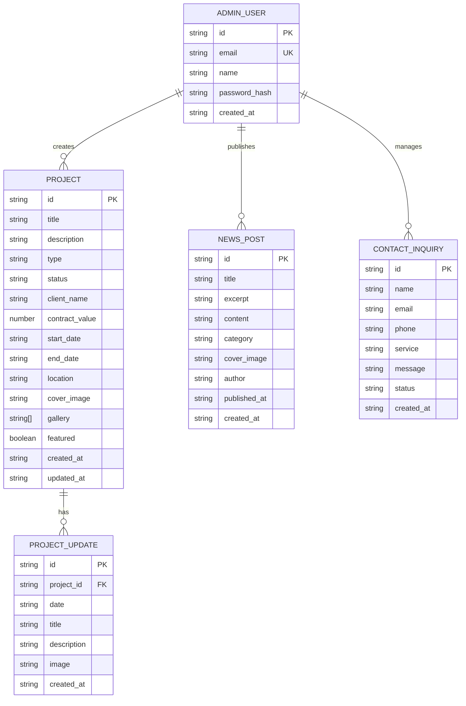

## 1. Architecture Design

```mermaid
graph TD
    subgraph "Frontend (Next.js 14 App Router)
        A["Public Pages (app/*)"] --> B["Shared Components (components/*)"]
        A --> C["State Management (zustand)"]
        A --> D["Styling (Tailwind CSS 3.4)"]
        A --> E["Animations (Framer Motion)"]
    end
    
    subgraph "Backend (Next.js API Routes)
        F["API Routes (app/api/*)"] --> G["Projects API"]
        F --> H["News API"]
        F --> I["Inquiries API"]
        F --> J["Auth API"]
    end
    
    subgraph "Data Layer"
        K["Mock/Dev: Local JSON + localStorage"]
        G --> K
        H --> K
        I --> K
        J --> K
    end
    
    subgraph "External Services (Placeholder)
        L["(Optional: Email (Nodemailer)"]
        M["(Optional: Image Upload (Cloudinary)"]
        N["(Optional: Supabase DB)"]
    end
    
    I --> L
    G --> M
    K --> N
```

## 2. Technology Description

- **Frontend Framework**: Next.js 14 (App Router) with React 18 + TypeScript 5
- **Styling**: Tailwind CSS 3.4 with custom theme tokens
- **Initialization Tool**: `create-next-app@latest with TypeScript, ESLint, Tailwind, src/ directory, App Router
- **State Management**: Zustand for client-side stores (auth, admin, toast notifications)
- **Animations**: Framer Motion for scroll animations, transitions, micro-interactions
- **Icons**: Lucide React
- **Date Handling**: date-fns for formatting dates and date formatting
- **Forms**: React Hook Form with Zod validation
- **Backend**: Next.js built-in API Routes (Edge Runtime compatible)
- **Data Persistence (Dev)**: LocalStorage with JSON seed files in /lib/data/*.json
- **Data Persistence (Production-ready optional)**: Supabase PostgreSQL with Prisma ORM (can be added later)
- **Authentication**: Custom session-based with bcrypt password hashing, JWT tokens (HttpOnly cookies)
- **Notifications**: Sonner for toast notifications

## 3. Route Definitions

| Route | Purpose |
|-------|---------|
| / | Home page (public) |
| /about | About Us page (public) |
| /services | Services page (public) |
| /projects | Projects listing with filters (public) |
| /projects/[id] | Project detail with timeline (public) |
| /news | News/Blog listing (public) |
| /news/[id] | News article detail (public) |
| /contact | Contact page with form (public) |
| /admin/login | Admin login page (public, auth gate) |
| /admin | Admin dashboard with analytics (protected) |
| /admin/projects | Projects CRUD list table (protected) |
| /admin/projects/new | Create new project/contract form (protected) |
| /admin/projects/[id]/edit | Edit existing project (protected) |
| /admin/projects/[id]/updates | Manage project timeline updates (protected) |
| /admin/news | News CRUD list (protected) |
| /admin/news/new | Create news post (protected) |
| /admin/news/[id]/edit | Edit news post (protected) |
| /admin/inquiries | Contact inquiries inbox (protected) |
| /admin/settings | Site settings (protected) |
| /api/auth/login | POST: Authenticate admin, return session cookie |
| /api/auth/logout | POST: Clear session cookie |
| /api/projects | GET: list, POST: create |
| /api/projects/[id] | GET: detail, PUT: update, DELETE: remove |
| /api/projects/[id]/updates | GET/POST: timeline updates |
| /api/news | GET/POST list/create |
| /api/news/[id] | GET/PUT/DELETE |
| /api/inquiries | GET list, POST new from contact form |
| /api/inquiries/[id] | GET detail, PATCH status |

## 4. API Definitions

```typescript
// ====== TYPES ======

type ProjectStatus = 'new_contract' | 'under_construction' | 'finished';
type ProjectType = 'residential' | 'commercial' | 'mixed_use' | 'special' | 'renovation';
type InquiryStatus = 'unread' | 'read' | 'replied';

interface Project {
  id: string;
  title: string;
  description: string;
  type: ProjectType;
  status: ProjectStatus;
  clientName: string;
  contractValue: number; // in ETB
  startDate: string; // ISO date
  endDate?: string; // ISO date
  location: string;
  coverImage: string;
  gallery: string[];
  updates: ProjectUpdate[];
  createdAt: string;
  updatedAt: string;
  featured: boolean;
}

interface ProjectUpdate {
  id: string;
  projectId: string;
  date: string; // ISO date
  title: string;
  description: string;
  image?: string;
  createdAt: string;
}

interface NewsPost {
  id: string;
  title: string;
  excerpt: string;
  content: string;
  category: string;
  coverImage: string;
  author: string;
  publishedAt: string;
  createdAt: string;
}

interface ContactInquiry {
  id: string;
  name: string;
  email: string;
  phone?: string;
  service?: string;
  message: string;
  status: InquiryStatus;
  createdAt: string;
}

interface AdminUser {
  id: string;
  email: string;
  name: string;
  passwordHash: string;
}

// ====== API SCHEMAS ======

// POST /api/auth/login
interface LoginRequest { email: string; password: string; }
interface LoginResponse { success: boolean; user: { id: string; email: string; name: string }; }

// GET /api/projects?status=X&type=Y&featured=true
interface ProjectsListResponse { projects: Project[]; total: number; }

// POST /api/projects
interface CreateProjectRequest {
  title: string; description: string; type: ProjectType; status: ProjectStatus;
  clientName: string; contractValue: number; startDate: string; endDate?: string;
  location: string; coverImage: string; gallery?: string[]; featured?: boolean;
}

// POST /api/projects/[id]/updates
interface CreateUpdateRequest { date: string; title: string; description: string; image?: string; }

// POST /api/inquiries
interface CreateInquiryRequest { name: string; email: string; phone?: string; service?: string; message: string; }
```

## 5. Server Architecture Diagram

```mermaid
graph TD
    A["Client (Browser)"] --> B["Next.js API Routes"]
    B --> C["app/api/auth/* Route Handlers"]
    C --> D["app/api/projects projects Controller (validate input, format response)
    D --> E["app/projects projects Service Layer (business rules, status transitions)
    E --> F["app/lib/data projects Repository (JSON file read/write + localStorage cache)
    F --> G["app/lib/seed/*.json app/lib/data JSON Files (seed data + runtime data)
    
    H["app/api/inquiries inquiries Controller"] --> I["app/projects inquiries Service"]
    I --> J["app/lib/data inquiries Repository"]
    
    K["app/api/news news Controller"] --> L["app/projects news Service"]
    L --> M["app/lib/data news Repository"]
    
    N["Auth Middleware"] --> O["Check session cookie for protected routes"]
```

## 6. Data Model

### 6.1 Data Model Definition



### 6.2 Data Definition Language (for future PostgreSQL migration)

```sql
-- Admin Users Table
CREATE TABLE admin_users (
    id UUID PRIMARY KEY DEFAULT gen_random_uuid(),
    email VARCHAR(255) UNIQUE NOT NULL,
    name VARCHAR(255) NOT NULL,
    password_hash VARCHAR(255) NOT NULL,
    created_at TIMESTAMPTZ DEFAULT NOW()
);

-- Projects Table
CREATE TABLE projects (
    id UUID PRIMARY KEY DEFAULT gen_random_uuid(),
    title VARCHAR(500) NOT NULL,
    description TEXT NOT NULL,
    type VARCHAR(50) NOT NULL CHECK (type IN ('residential', 'commercial', 'mixed_use', 'special', 'renovation')),
    status VARCHAR(50) NOT NULL CHECK (status IN ('new_contract', 'under_construction', 'finished')),
    client_name VARCHAR(255) NOT NULL,
    contract_value DECIMAL(15,2) NOT NULL DEFAULT 0,
    start_date DATE NOT NULL,
    end_date DATE,
    location VARCHAR(500) NOT NULL,
    cover_image VARCHAR(1000),
    gallery TEXT[],
    featured BOOLEAN DEFAULT FALSE,
    created_at TIMESTAMPTZ DEFAULT NOW(),
    updated_at TIMESTAMPTZ DEFAULT NOW()
);

CREATE INDEX idx_projects_status ON projects(status);
CREATE INDEX idx_projects_type ON projects(type);
CREATE INDEX idx_projects_featured ON projects(featured);

-- Project Updates Table
CREATE TABLE project_updates (
    id UUID PRIMARY KEY DEFAULT gen_random_uuid(),
    project_id UUID NOT NULL REFERENCES projects(id) ON DELETE CASCADE,
    date DATE NOT NULL,
    title VARCHAR(500) NOT NULL,
    description TEXT NOT NULL,
    image VARCHAR(1000),
    created_at TIMESTAMPTZ DEFAULT NOW()
);

CREATE INDEX idx_updates_project_id ON project_updates(project_id);

-- News Posts Table
CREATE TABLE news_posts (
    id UUID PRIMARY KEY DEFAULT gen_random_uuid(),
    title VARCHAR(500) NOT NULL,
    excerpt TEXT NOT NULL,
    content TEXT NOT NULL,
    category VARCHAR(100) NOT NULL,
    cover_image VARCHAR(1000),
    author VARCHAR(255) NOT NULL,
    published_at TIMESTAMPTZ DEFAULT NOW(),
    created_at TIMESTAMPTZ DEFAULT NOW()
);

-- Contact Inquiries Table
CREATE TABLE contact_inquiries (
    id UUID PRIMARY KEY DEFAULT gen_random_uuid(),
    name VARCHAR(255) NOT NULL,
    email VARCHAR(255) NOT NULL,
    phone VARCHAR(50),
    service VARCHAR(100),
    message TEXT NOT NULL,
    status VARCHAR(20) NOT NULL DEFAULT 'unread' CHECK (status IN ('unread', 'read', 'replied')),
    created_at TIMESTAMPTZ DEFAULT NOW()
);

-- Initial Admin Seed
INSERT INTO admin_users (email, name, password_hash) VALUES
('admin@lamed.com', 'Lamed Admin','$2a$10$...'); -- bcrypt of 'admin123'

```
```
